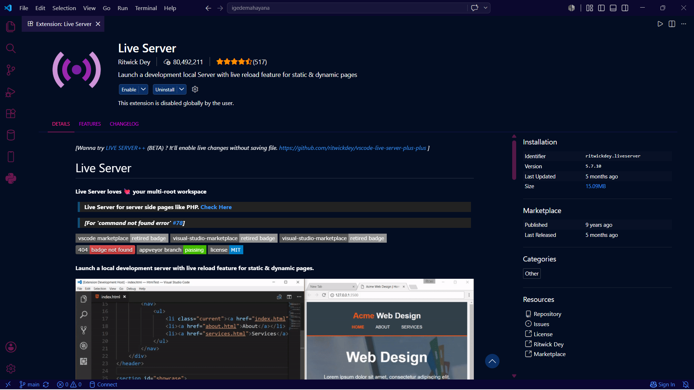
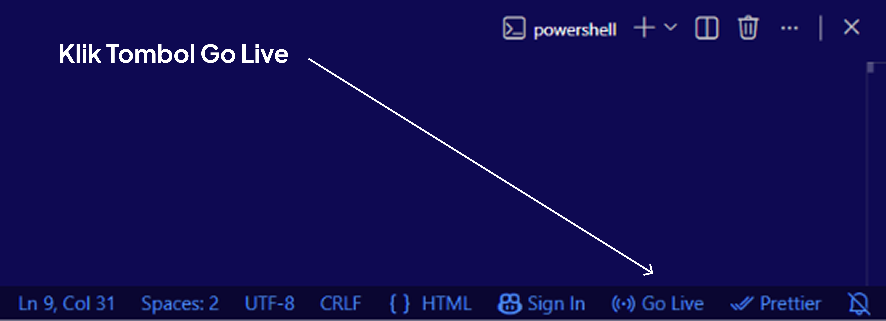
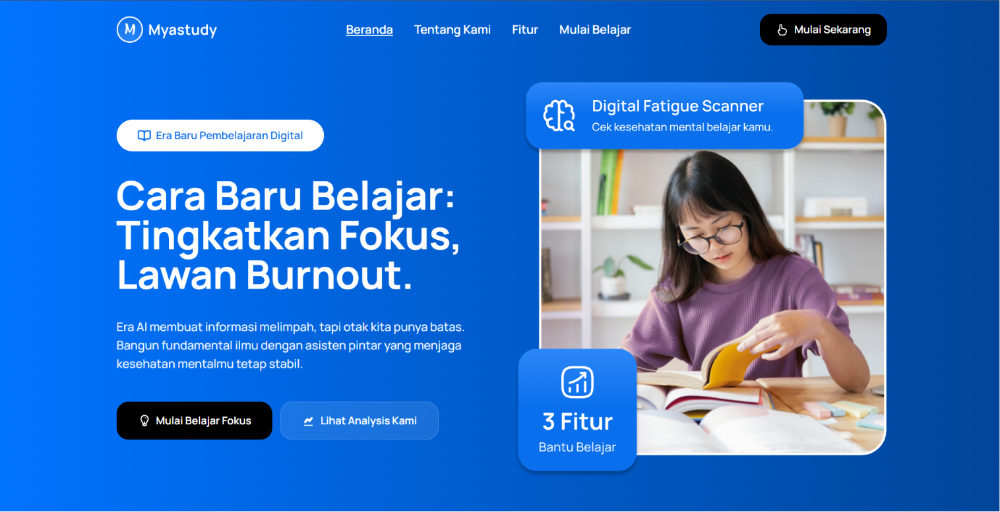
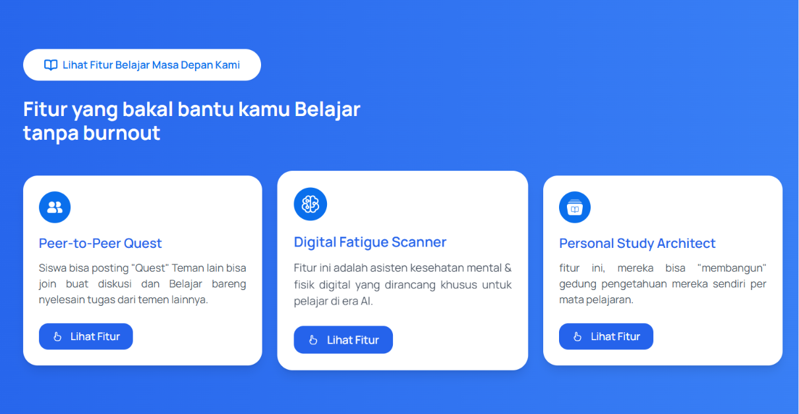
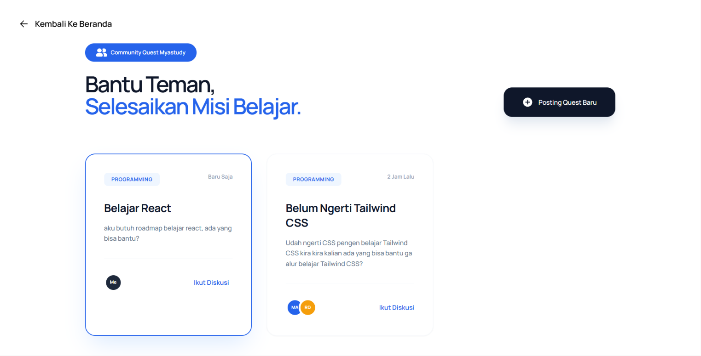
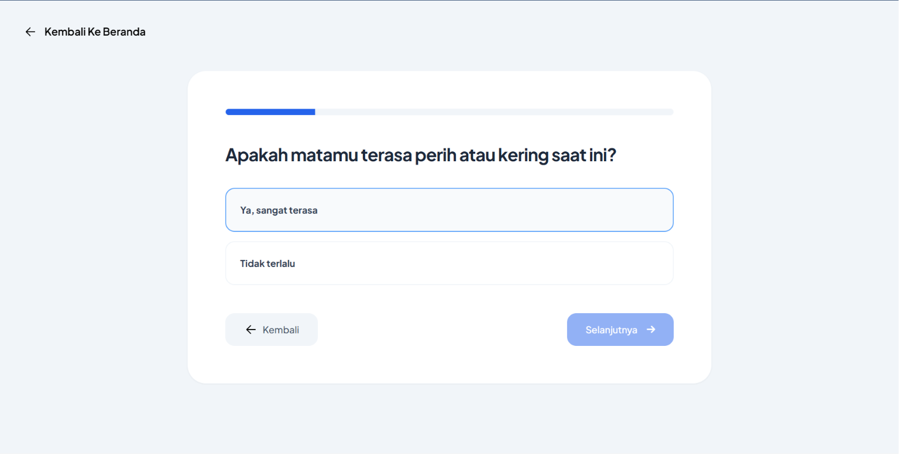
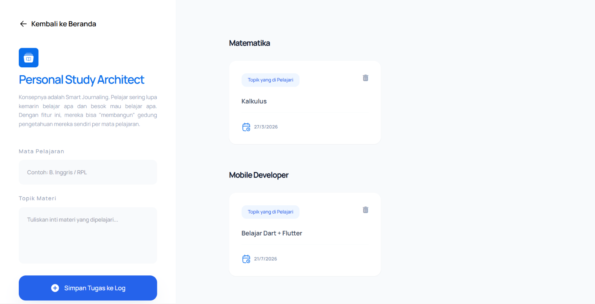

# Judul Website: Myastudy

# Bidang Lomba: Web Design Tech Fest INSTIKI 2026

## Teknologi yang digunakan

1. Figma
2. HTML
3. Tailwind
4. JavaScript

## Cara Menjalankan Project Myastudy

### 1. Clone Repository

Clone Repository Myanastudy:

```bash
git clone https://github.com/igedemahayana/Myastudy.git
```

### 2. Buka Project di IDE

Buka menggunakan Visual Studio Code

### 3. Install Extension Live Server

Jika menggunakan Visual Studio Code:

1. Buka menu Extensions (CTRL + Shift + X)
2. Cari Live Server
3. Install extension tersebut

<p align="center">
  
</p>

### 4. Jalankan Website

Setelah extension terinstall:

Klik tombol “Go Live” di pojok kanan bawah Visual Studio Code

<p align="center">
  
</p>

### 5. Website Berhasil Dijalankan

Setelah berhasil, website Myastudy akan otomatis terbuka di browser.

### Hero Section

<p align="center">
  
</p>

### 3 Features Myastudy

<p align="center">
  
</p>

### Peer To Peer Quest

Siswa bisa posting "Quest" Teman lain bisa join buat diskusi dan Belajar bareng nyelesain tugas dari temen lainnya.

<p align="center">
  
</p>

### Digital Fatigue Scanner

Fitur ini adalah asisten kesehatan mental & fisik digital yang dirancang khusus untuk pelajar di era AI.

<p align="center">
  
</p>

### Personal Study Architect

fitur ini, mereka bisa "membangun" gedung pengetahuan mereka sendiri per mata pelajaran.

<p align="center">
  
</p>

### Coba Website Disini:

```bash
https://myastudy.vercel.app/
```
